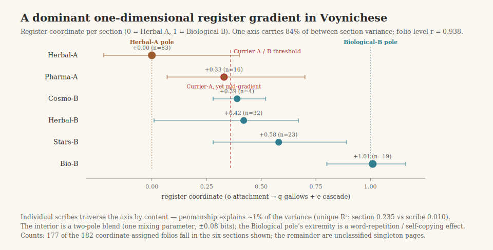

# voynich-transfer



Code and result artifacts for **inventory transfer**: a reproducible method for measuring the internal structural similarity between regions of an undeciphered text, applied to the Voynich Manuscript.

For each region of text, a greedy optimizer discovers the sequence of adjacent glyph-pair merges that most raises conditional character entropy (h2). Replaying one region's merge inventory on another region ("transfer") and measuring how much of that region's own entropy gain is recovered gives a similarity score between the two regions' internal machinery. Twenty pre-specified experiments apply this across dialects, scribal hands, sections, folios, labels, and synthetic controls.

**Headline result:** the whole manuscript sits on a single, robust, one-dimensional register gradient (84% of variance on one axis), anchored by Herbal-A and Biological-B. Currier's A/B split is a threshold on that continuum, not a structural cliff; individual scribes traverse it by section (penmanship explains ~1% of unique variance once section is known); and controls show the gradient is real but reproducible by both meaningful and meaningless processes — so it constrains interpretation without deciding it.

**This is not a decipherment.** It is a reproducible measurement that any future account of the manuscript — cipher, language, or generated text — has to explain.

For the full argument, all twenty experiments, numbers, and caveats, read **[docs/RESEARCH_NOTE.md](docs/RESEARCH_NOTE.md)** — that is the primary document in this repository; everything else here supports it.

- [docs/RESEARCH_NOTE.md](docs/RESEARCH_NOTE.md) — the complete write-up: method, all 20 experiments, prediction ledger, limitations, reproducibility details, references.
- [docs/VALIDATION_ADDENDUM.md](docs/VALIDATION_ADDENDUM.md) — Experiments 21/21b: a known-structure positive control (a "calibration ladder" of real texts with known language/authorship) validating that the metric recovers ground truth and that the Currier A/B gap is register-sized, not language-sized.
- [docs/ABSTRACT.md](docs/ABSTRACT.md) — short formal abstract and a forum-post-length summary.
- [docs/DATA.md](docs/DATA.md) — how to fetch the corpora and run the scripts.
- [docs/figure1.svg](docs/figure1.svg) — the manuscript map figure referenced in the research note.

## Repository layout

```text
scripts/   19 experiment scripts (Python 3 + NumPy, no other dependencies)
results/   committed reference *_results.json outputs, one per script that writes one
           (plus results_consolidated.json — a hand-maintained, all-in-one summary of
           every experiment's headline numbers; not regenerated by any script, so treat
           it as a convenience index rather than a primary source — see .gitignore for
           how to restore any of these after a local rerun)
docs/      RESEARCH_NOTE.md, VALIDATION_ADDENDUM.md, ABSTRACT.md, DATA.md, figure1.svg
```

`Voynich-public/` and `voynich-transcription/` (the third-party transliteration corpora) are **not** included — see [docs/DATA.md](docs/DATA.md) to clone them into the repo root. Every script resolves its paths against the current working directory, so **always run from the repository root**, e.g. `python scripts/verbose_search.py`.

## Script → experiment map

Run roughly in this order; a few scripts consume another script's JSON output (noted below).

| Script | Experiment(s) | Reads | Output |
|---|---|---|---|
| `scripts/verbose_search.py` | 1 — full manuscript vs. medieval languages, Markov control | — | `results/results.json` |
| `scripts/ab_search.py` | 2 — Currier A vs. B | — | `results/ab_results.json` |
| `scripts/scribes.py` | 3 — scribal hands vs. dialect | — | `results/scribes_results.json` |
| `scripts/section_experiment.py` | 4 (topic×dialect factorial) & 5 (Minimal-parse rerun) | — | **stdout only** |
| `scripts/robustness_windows.py` | alternate-window replication check for the Exp 4/6 anomalies (Pharma-A, Herbal-B) | — | **stdout only** |
| `scripts/map_experiment.py` | 6 — the 13-unit transfer map and seriation | — | `results/map_results.json` |
| `scripts/folio_gradient.py` | 7 — per-folio projection onto the gradient | `results/map_results.json` | `results/folio_gradient.json` |
| `scripts/scribe_decomposition.py` | 8 — scribe vs. section/register commonality decomposition | `results/folio_gradient.json` | **stdout only** |
| `scripts/timm_tests.py` | 9 — gradient vs. Timm's self-copying drift model | `results/folio_gradient.json` | **stdout only** |
| `scripts/robust_run.py` | 10 — v101 parse replication, stochastic restarts | — | **stdout only** |
| `scripts/generative_model.py` | 11 — one-parameter bigram-mixture generator | — | `results/gen_results.json` |
| `scripts/label_experiment.py` | 12 — label morphology vs. referent | — | `results/label_results.json` |
| `scripts/exp13_synthetic_controls.py` | 13 — synthetic controls (random bigram, section-mixture, self-copying, verbose cipher) | — | `results/exp13_results.json` |
| `scripts/exp14_15.py` | 14 (leave-one-section-out) & 15 (shuffle nulls) | — | `results/exp14_15_results.json` |
| `scripts/exp16_ts_generator.py` | 16 — faithful-in-mechanism self-copying generator | — | `results/exp16_results.json` |
| `scripts/exp17_18_19.py` | 17 (beam search), 18 (cross-transcriber), 19 (label n-grams) | — | `results/exp17_18_19_results.json` |
| `scripts/exp20_calibrated_generator.py` | 20 — self-copying generator calibrated to the pole | — | `results/exp20_results.json` |
| `scripts/exp21_known_structure.py` | 21 — known-structure calibration ladder (positive control) | — | `results/exp21_results.json` |
| `scripts/exp21b_ladder_robustness.py` | 21b — calibration ladder re-drawn on a second, non-overlapping sample | — | `results/exp21b_results.json` |

See [docs/VALIDATION_ADDENDUM.md](docs/VALIDATION_ADDENDUM.md) for Experiments 21/21b's design and results.

**stdout only** means the script prints its findings but writes no JSON — there is no committed reference file to diff a rerun against for Experiments 4, 5, 8, 9, 10, or the window-replication check; verify those by comparing printed output to the corresponding numbers in `docs/RESEARCH_NOTE.md` (and, for a same-page summary, `results/results_consolidated.json` — see "Repository layout" above).

Each script prints its findings to stdout and writes/updates the matching file in `results/`. See [docs/DATA.md](docs/DATA.md) for corpus setup, calibration numbers, and how to restore the committed reference JSON after a local rerun.

## AI usage

This is a solo research project on a problem well beyond what would otherwise be tractable for one person in the available time. It was carried out with **extensive AI assistance throughout** — including Claude (Fable 5 and Opus 4.8, via Claude Code) and ChatGPT-5 — used for ideation, experiment design and critique, writing and debugging the analysis code, running the computations, and drafting/editing the research note and this documentation. The human author directed the research questions, reviewed and pressure-tested every result, and is responsible for the final claims. This disclosure is meant as a straightforward statement of method, in the same spirit as the repository's invitation to scrutinize and "tear it apart."

## License / citation

MIT licensed — see [LICENSE](LICENSE). If you use this code or these results, please cite via [CITATION.cff](CITATION.cff).
